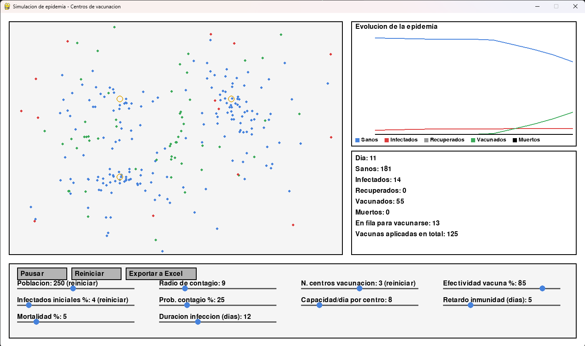

# Simulacion de epidemia con Pygame

**Autor:** Andres Camilo Vivas Baquero

Trabajo de simulacion de una epidemia tipo COVID-19, usando el modelo SIR
(sanos, infectados, recuperados) visto en clase, con pygame.

## Video y foto de ejecución del programa 

https://drive.google.com/file/d/1-ewCTiROeGCNHXMDXgRsut_NAH540Ltt/view?usp=sharing



## Idea del proyecto

Ademas de la simulacion basica (gente moviendose, contagiandose y
recuperandose), agregamos un caso de decision propio: **centros de
vacunacion con capacidad limitada**.

- Hay un numero configurable de centros de vacunacion en el mapa.
- La gente sana va decidiendo, dia a dia, ir a vacunarse al centro mas
  cercano.
- Cada centro solo puede vacunar a X personas por dia (parametro
  "Capacidad/dia por centro"). Si llega mas gente de la que se puede
  atender, se hace una fila.
- Estar en la fila junta a mucha gente en el mismo punto, entonces si
  alguien infectado pasa cerca, hay mas riesgo de contagio ahi. Ese es el
  dilema: ir a vacunarse te protege a futuro pero te expone mas en el
  momento.
- La vacuna tampoco es perfecta: tarda unos dias en hacer efecto y tiene un
  porcentaje de efectividad.

## Como funciona el codigo

**`main.py`** tiene tres clases:

- `Persona`: cada punto de la simulacion. Guarda su posicion, su estado
  de salud (sano, infectado, recuperado, muerto o vacunado) y en que
  parte del proceso de vacunacion va (si esta yendo a un centro, en fila,
  esperando que la vacuna haga efecto, etc).
- `CentroVacunacion`: guarda su posicion, la fila de personas esperando y
  cuantas vacunas lleva aplicadas.
- `Slider`: el control deslizante que se dibuja y se puede arrastrar con
  el mouse para cambiar un parametro.

Despues vienen las funciones que hacen avanzar la simulacion:

- `crear_personas` y `crear_centros` arman la poblacion y los centros al
  inicio, o cada vez que se le da a "Reiniciar".
- `mover_personas` mueve a todos un frame: caminata aleatoria para los
  que no van a vacunarse, movimiento directo hacia el centro para los que
  si, y revisa si alguien ya llego para meterlo en la fila.
- `revisar_contagios` mira, una vez por dia, que tan cerca esta cada
  infectado de cada sano y tira una probabilidad de contagio.
- `actualizar_enfermedad` cuenta los dias que lleva infectada cada
  persona y decide si se recupera o muere al terminar.
- `procesar_vacunacion` maneja todo lo de los centros: quien decide ir a
  vacunarse, a cuantos atiende cada centro por dia segun su capacidad, y
  el retraso hasta que la vacuna hace efecto.
- `un_dia_mas` llama a esas tres ultimas funciones en orden, una vez por
  cada dia simulado.

Las funciones que empiezan con `dibujar_` solo pintan en pantalla (la
gente, el grafico, los contadores, los botones); no cambian la logica de
la simulacion. Y `main()` tiene el ciclo de pygame: lee el mouse, mueve
la simulacion si no esta pausada, y dibuja todo de nuevo en cada vuelta.

**`exportar_excel.py`** tiene una sola funcion que junta el historial de
cada dia y los parametros usados, y los guarda en un `.xlsx` con dos
hojas usando pandas.

## Como correrlo

El proyecto ya tiene un entorno virtual armado en la carpeta `.venv313`
(Python 3.13) con pygame, pandas y openpyxl instalados. Se usa ese en vez
del python del sistema, porque pygame todavia no tiene instalador
precompilado para versiones nuevas de Python en Windows (si se intenta
instalar con un python muy nuevo, pip trata de compilarlo desde cero y
tira error).

```
.venv313\Scripts\python.exe main.py
```

O activando el entorno primero:

```
.venv313\Scripts\Activate.ps1
python main.py
```

Si se quiere armar el entorno desde cero en otra maquina, hay que crear un
entorno virtual con Python 3.13 (o similar) e instalar los paquetes de
`requirements.txt` ahi adentro:

```
py -3.13 -m venv .venv313
.venv313\Scripts\Activate.ps1
pip install -r requirements.txt
```

## Controles

- **Pausar/Reanudar**: para congelar la simulacion.
- **Reiniciar**: crea una simulacion nueva desde el dia 0, usando los
  valores actuales de los sliders (los que dicen "(reiniciar)" solo se
  aplican con este boton, el resto se aplican al momento).
- **Exportar a Excel**: guarda los datos de la corrida actual en la carpeta
  `resultados/`, en un archivo con la fecha y hora, con una hoja de datos
  por dia y otra con los parametros usados.
